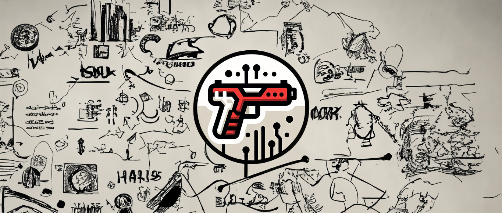

# Netease BUFF Trade Bot

<div align="center">
   
</div>

## Project Overview
Netease BUFF Trade Bot is an automation bot designed to assist users in executing trades on the third-party game skin marketplace, Netease BUFF. This project is primarily aimed at large-scale traders who require automated trading solutions to reduce manual operations and increase efficiency in buying and selling skins.

The project is based on the CS:GO (Counter-Strike: Global Offensive) skin market, where virtual items have collectible value, and the supply-demand dynamics influence their pricing.

## Background
CS:GO is a multiplayer online first-person shooter developed by Valve Corporation. The game features a skin system where players can buy, sell, and trade virtual items, which are highly valued due to their rarity and cosmetic appeal.

The CS:GO skin market is complex, functioning similarly to a stock exchange where prices fluctuate based on item rarity, demand, and wear conditions. Besides the official Steam market, third-party platforms like Netease BUFF also support skin trading.

## Features
- **Automated Trading Flow**: Automatically completes market scanning, placing offers, and confirming transactions based on preset conditions.
- **Support for Various Trading Parameters**: Users can set parameters (such as price, wear level, rarity) to automate skin purchases and sales.
- **Efficient Competitive Pricing**: Quickly adjusts offers to compete with other buyers and sellers in a competitive market.
- **Chrome Extension Implementation**: The project is implemented as a Chrome extension for convenient operation directly in the user’s browser.

## Tech Stack
- **JavaScript (ECMAScript 6)**: The core logic is implemented using raw JavaScript without relying on external DOM manipulation frameworks.
- **Chrome Extension**: The extension allows real-time market monitoring and automated trading actions.
- **MutationObserver**: Monitors changes in the webpage DOM for real-time response to market updates.
- **Async Function**: Implements non-blocking asynchronous operations for efficient trade execution.
- **Bootstrap**: Used for building responsive and user-friendly UI components.

## Project Architecture
The project is divided into two main parts:
1. **Frontend Scripts**: Injected into the web page to handle automated trading logic.
    - `toolBarInject.js`: Injects the toolbar into the webpage.
    - `trade.js`: Manages the trading logic.
    - `monitor.js`: Monitors changes in the trading pages.
2. **Background Services**: Handles tasks running in the background via the Chrome extension.
    - `taskSchedule.js`: Schedules tasks for automated operations.
    - `waitingSupply.js`: Handles logic for waiting on supply.

## Installation and Usage
### 1. Install the Chrome Extension
1. Clone or download the project files to your local machine.
2. Open Chrome and go to `chrome://extensions/`.
3. Click on “Load unpacked” and select the project’s root directory.
4. Once loaded, you will see the extension icon in the browser’s toolbar.

### 2. Configure Automated Trading Parameters
1. Go to the Netease BUFF website and click on the extension icon in the toolbar.
2. Set the desired trading parameters (such as target skins, price ranges) via the plugin’s interface.
3. Click the “Start” button to initiate the automated trading process.

## Usage Example
1. Select the skin you wish to purchase from the Netease BUFF marketplace.
2. Configure your trading parameters, and after clicking “Start,” the bot will automatically scan and perform trades.

## Getting Started to Contribute

1. Clone the repository:
   ```sh
   git clone https://github.com/SolitudeRA/Netease-Buff-Trade-Bot
   
## Contributing
Contributions are welcome! Please fork the repository and submit a pull request for any enhancements or bug fixes.

## License

This project is licensed under the GNU General Public License v3.0. See the [LICENSE](./LICENSE) file for details.
